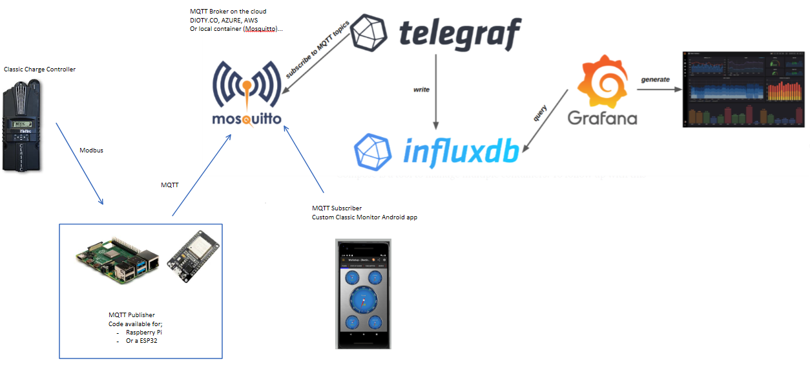
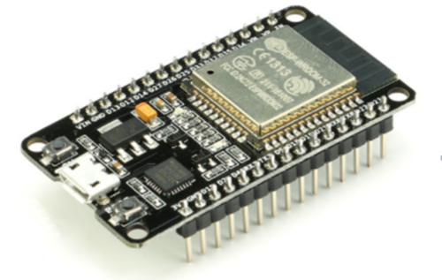

<h1>Modbus to MQTT publisher for the Midnite Solar Classic Charge Controller</h1>

<a href="https://www.buymeacoffee.com/r4K2HIB" target="_blank"></a>

[](https://hits.seeyoufarm.com)

[](https://github.com/ClassicDIY/ClassicMQTT/releases)
[](https://github.com/ClassicDIY/ClassicMQTT/releases)
[](https://github.com/ClassicDIY/ClassicMQTT/issues)



<p>
The ClassicMQTT publisher will read data from your classic charge controller using the Modbus protocol and publish the data to a MQTT broker. If you use a cloud based broker like <a href="http://www.dioty.co/">dioty.co</a> then you can monitor your classic charge controller from anywhere on the internet using the Android MQTT subscriber App. This also allows you to integrate other MQTT subscriber applications like HomeAssistant, NodeRed, InfluxDB and Grafana.

The software is provided "AS IS", WITHOUT WARRANTY OF ANY KIND, express or implied.
Classic Monitor is NOT a product of Midnite solar, nor do they support this application!
</p>

<p>
The code for the ClassicMQTT publisher has been implemented for the 
<a href="https://github.com/ClassicDIY/ClassicMQTT/tree/master/code/ESP32">ESP32 dev board</a> and for the 
<a href="https://github.com/ClassicDIY/ClassicMQTT/tree/master/code/Python">Raspberry Pi</a>.
</p>

<p align="center">
  
  
</p>

<p>
Please refer to the <a href="https://github.com/ClassicDIY/ClassicMQTT/wiki">ClassicMQTT wiki</a> for more information.
</p>

<h3>Classic Monitor MQTT Subscriber app for Android is available here.</h3>

<p>
  https://drive.google.com/drive/folders/1FPijqIw0VuKCE0gOxg3Z0YIddFnxmAuN?usp=sharing
</p>

<p>
If you have Google Drive installed on your device, simply click on the link to install.
You might be asked to allow the installation of an app from an unknown source.</h3>
</p>

## License
```

 Copyright (c) 2019

  Licensed under the Apache License, Version 2.0 (the "License");
  you may not use this file except in compliance with the License.
  You may obtain a copy of the License at

       http://www.apache.org/licenses/LICENSE-2.0

  Unless required by applicable law or agreed to in writing, software
  distributed under the License is distributed on an "AS IS" BASIS,
  WITHOUT WARRANTIES OR CONDITIONS OF ANY KIND, either express or implied.
  See the License for the specific language governing permissions and
  limitations under the License.

```


