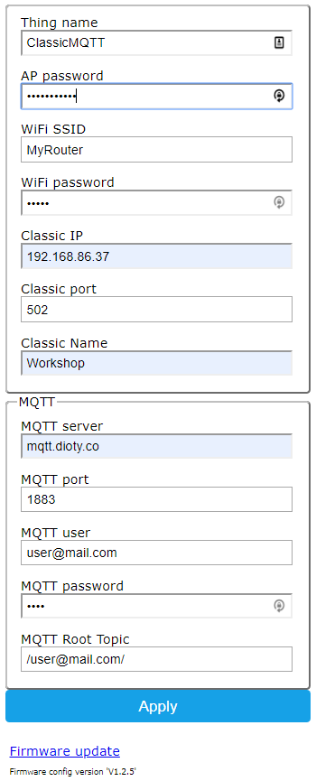

<h1>Classic Monitor ESP32 MQTT publisher</h1>


<p>
Classic Monitor MQTT will read data from your classic over Modbus and publish it to a MQTT broker. It is a Read Only Program, it does not write to the Classic.

The software is provided "AS IS", WITHOUT WARRANTY OF ANY KIND, express or implied.
Classic Monitor is NOT a product of Midnite solar, nor do they support this application!
</p>

<p align="center">
  
  
  <a href="https://www.amazon.ca/Development-Wireless-Module-Bluetooth-Arduino/dp/B07HG5XHLB/ref=sr_1_7?crid=2TVCRO81CV0D4&keywords=esp32+development+board&qid=1580566571&sprefix=esp32%2Caps%2C367&sr=8-7">ESP32 dev board</a>
 
</p>
<p>
Please refer to the IotWebConf for the ESP32 Wifi setup: https://github.com/prampec/IotWebConf.
</p>
<p align="center">
   
  
  The AP Password is initially set to ClassicMQTT and must be changed to be able to apply the changes (can reuse ClassicMQTT)
  Once the app is in Station mode, the setup page can be accessed with admin:AP Password
</p>
<p>
the binary for the ESP32 is available here https://github.com/graham22/ClassicMQTT/releases.
</p>

<h3>Classic Monitor MQTT Subscriber app for Android is available here.</h3>

<p>
  https://drive.google.com/drive/folders/1S2BWLFn_nU0NmxXmyhJaz97h0K1_OY6B
</p>

<p>
If you have Google Drive installed on your device, simply click on the link to install.
You might be asked to allow the installation of an app from an unknown source.</h3>
</p>


<p>
Online help for the Android app: http://graham22.github.io/Classic/classicmonitor/help_en.html
</p>

Development environment used is Visual Studio CODE with the PlatformIO extension

## License
```

 Copyright (c) 2019

  Licensed under the Apache License, Version 2.0 (the "License");
  you may not use this file except in compliance with the License.
  You may obtain a copy of the License at

       http://www.apache.org/licenses/LICENSE-2.0

  Unless required by applicable law or agreed to in writing, software
  distributed under the License is distributed on an "AS IS" BASIS,
  WITHOUT WARRANTIES OR CONDITIONS OF ANY KIND, either express or implied.
  See the License for the specific language governing permissions and
  limitations under the License.

```


Release notes:

-----------------

version 1.2

<ul>
<li>Updated to use IOTWebConf and AsyncMQTTClient</li>
</ul>

-----------------
version 1.0.0

<ul>
<li>Initial Release</li>
</ul>

-----------------

