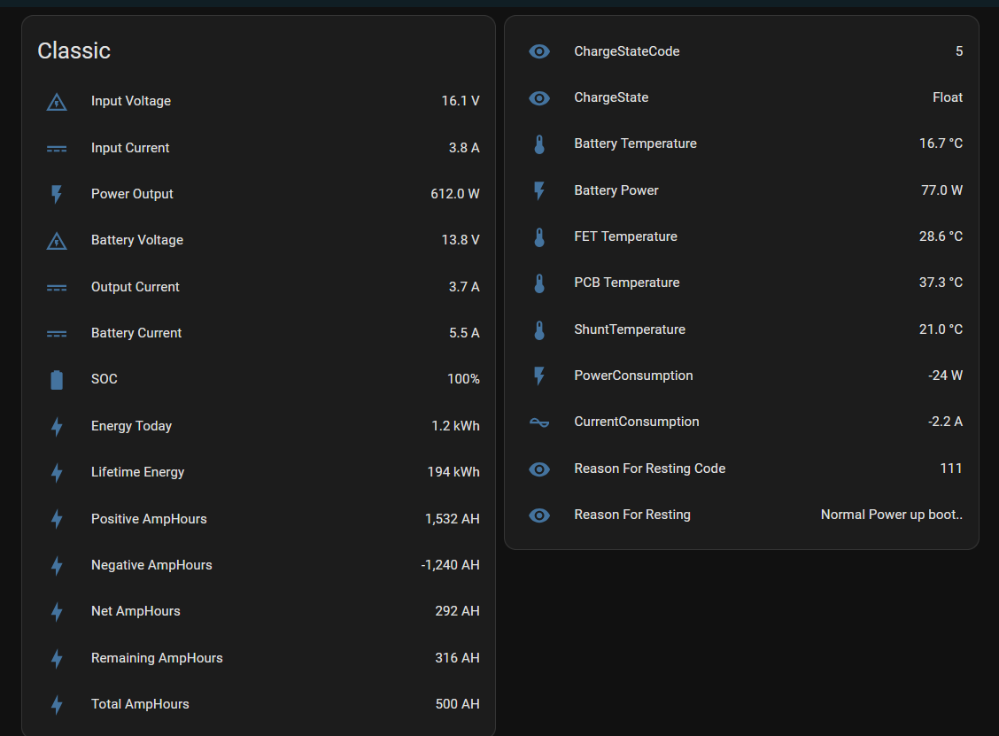

<h1>HomeAssistant Modbus TCP configuration</h1>

The HomeAssistant Modbus TCP configuration as an alternative to using MQTT.
No need for a RPi or ESP32, HA connects directly to the classic
Cons: Classic only supports one TCP connection at a time, so no other connections like Node-red or the Android App

  
  

