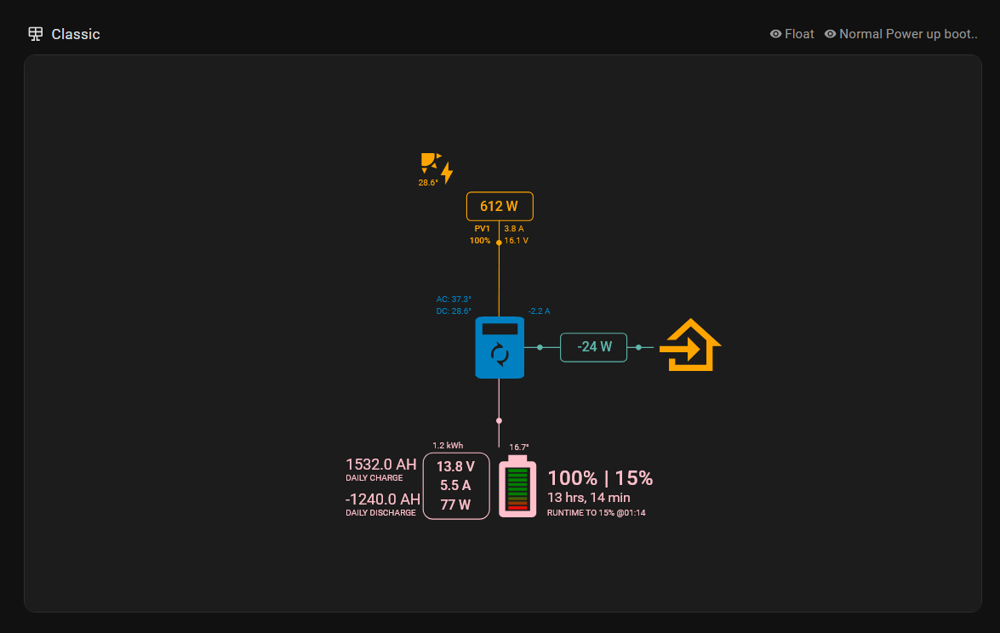

<h1>HomeAssistant Modbus TCP configuration</h1>

The HomeAssistant Modbus TCP configuration as an alternative to using MQTT.
No need for a RPi or ESP32, HA connects directly to the classic.
Cons: Classic only supports one TCP connection at a time, so no other connections like Node-red or the Android App.

<ul>
<li>1. Copy the content from this configuration.yaml into your configuration.</li>
<li>2. Change the IP address to your classic's IP.</li>
<li>Example views are avaliable in the ui-lovalace.yaml</li>
  
</ul>

  
  

